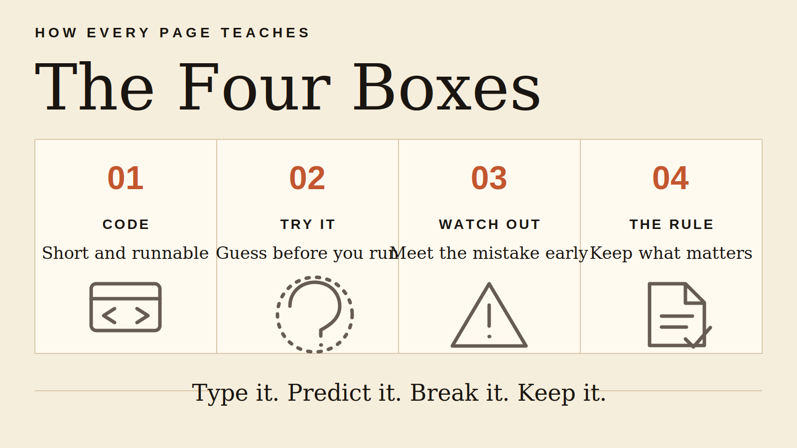

<p align="center">
  <a href="https://leanpub.com/pytorchfromgroundup">
    
  </a>
</p>

<p align="center"><strong><a href="https://leanpub.com/pytorchfromgroundup">Buy PyTorch From Ground Up on Leanpub →</a></strong></p>

# PyTorch From Ground Up — Companion Notebooks

Runnable, CPU-friendly study notebooks for **PyTorch From Ground Up, Volume I: Foundations** by Wesam M. Khallaf.

The repository follows all 34 numbered chapters in the book. Each notebook includes chapter-specific learning objectives, small deterministic examples, shape and correctness checks, and practice prompts—without required dataset downloads.

## Table of contents

| Part | Chapters |
|---|---:|
| [Orientation & Setup](#part-0---orientation--setup) | 1 |
| [I · Tensor Fluency](#part-i---tensor-fluency) | 2–12 |
| [II · How Learning Actually Happens](#part-ii---how-learning-actually-happens) | 13–17 |
| [III · Building Models from Blocks](#part-iii---building-models-from-blocks) | 18–22 |
| [IV · Feeding Data](#part-iv---feeding-data) | 23–26 |
| [V · The Training Loop, Mastered](#part-v---the-training-loop-mastered) | 27–31 |
| [VI · Evaluation, Debugging & Seeing Inside](#part-vi---evaluation-debugging--seeing-inside) | 32–34 |

## The Four Boxes teaching method

Every chapter follows the same active-learning rhythm:

- **Code** — type a short, runnable example and inspect the real output.
- **Try It** — predict what will happen before running the next variation.
- **Watch Out** — meet the common mistake early and learn how to diagnose it.
- **The Rule** — keep the durable principle that carries into the next chapter.



## Start here

### Google Colab

Select **Open in Colab** beside any chapter below. In a fresh Colab runtime, PyTorch is normally already installed.

### Run locally

```bash
git clone https://github.com/pytorch-from-ground-up/book_code.git
cd book_code
python -m venv .venv
source .venv/bin/activate  # Windows: .venv\Scripts\activate
pip install -r requirements.txt
jupyter lab
```

All examples are designed to run on CPU. Chapter 30 detects CUDA or Apple MPS when available and otherwise uses CPU.

## How to study

1. Read the matching book chapter first.
2. Predict each output and shape before running the cell.
3. Change one value or axis and explain the result.
4. Complete the practice prompts from memory.
5. Return to the chapter's exercises for deeper work.

## Notebook index


### Part 0 - Orientation & Setup

| Chapter | Notebook | Colab |
|---:|---|---|
| 1 | [Your Workbench](notebooks/part-0-orientation/01-your-workbench.ipynb) | [Open in Colab](https://colab.research.google.com/github/pytorch-from-ground-up/book_code/blob/main/notebooks/part-0-orientation/01-your-workbench.ipynb) |

### Part I - Tensor Fluency

| Chapter | Notebook | Colab |
|---:|---|---|
| 2 | [What a Tensor Really Is](notebooks/part-1-tensor-fluency/02-what-a-tensor-really-is.ipynb) | [Open in Colab](https://colab.research.google.com/github/pytorch-from-ground-up/book_code/blob/main/notebooks/part-1-tensor-fluency/02-what-a-tensor-really-is.ipynb) |
| 3 | [Your First Complete Model](notebooks/part-1-tensor-fluency/03-your-first-complete-model.ipynb) | [Open in Colab](https://colab.research.google.com/github/pytorch-from-ground-up/book_code/blob/main/notebooks/part-1-tensor-fluency/03-your-first-complete-model.ipynb) |
| 4 | [Creating & Inspecting Tensors](notebooks/part-1-tensor-fluency/04-creating-and-inspecting-tensors.ipynb) | [Open in Colab](https://colab.research.google.com/github/pytorch-from-ground-up/book_code/blob/main/notebooks/part-1-tensor-fluency/04-creating-and-inspecting-tensors.ipynb) |
| 5 | [Indexing & Slicing](notebooks/part-1-tensor-fluency/05-indexing-and-slicing.ipynb) | [Open in Colab](https://colab.research.google.com/github/pytorch-from-ground-up/book_code/blob/main/notebooks/part-1-tensor-fluency/05-indexing-and-slicing.ipynb) |
| 6 | [Reshaping the World](notebooks/part-1-tensor-fluency/06-reshaping-the-world.ipynb) | [Open in Colab](https://colab.research.google.com/github/pytorch-from-ground-up/book_code/blob/main/notebooks/part-1-tensor-fluency/06-reshaping-the-world.ipynb) |
| 7 | [Squeeze, Unsqueeze & Adding Axes](notebooks/part-1-tensor-fluency/07-squeeze-unsqueeze-adding-axes.ipynb) | [Open in Colab](https://colab.research.google.com/github/pytorch-from-ground-up/book_code/blob/main/notebooks/part-1-tensor-fluency/07-squeeze-unsqueeze-adding-axes.ipynb) |
| 8 | [Permute, Transpose & Axis Order](notebooks/part-1-tensor-fluency/08-permute-transpose-axis-order.ipynb) | [Open in Colab](https://colab.research.google.com/github/pytorch-from-ground-up/book_code/blob/main/notebooks/part-1-tensor-fluency/08-permute-transpose-axis-order.ipynb) |
| 9 | [Broadcasting](notebooks/part-1-tensor-fluency/09-broadcasting.ipynb) | [Open in Colab](https://colab.research.google.com/github/pytorch-from-ground-up/book_code/blob/main/notebooks/part-1-tensor-fluency/09-broadcasting.ipynb) |
| 10 | [Reductions & Element-wise Math](notebooks/part-1-tensor-fluency/10-reductions-element-wise-math.ipynb) | [Open in Colab](https://colab.research.google.com/github/pytorch-from-ground-up/book_code/blob/main/notebooks/part-1-tensor-fluency/10-reductions-element-wise-math.ipynb) |
| 11 | [Joining & Splitting](notebooks/part-1-tensor-fluency/11-joining-and-splitting.ipynb) | [Open in Colab](https://colab.research.google.com/github/pytorch-from-ground-up/book_code/blob/main/notebooks/part-1-tensor-fluency/11-joining-and-splitting.ipynb) |
| 12 | [Tensor Fluency Lab](notebooks/part-1-tensor-fluency/12-tensor-fluency-lab.ipynb) | [Open in Colab](https://colab.research.google.com/github/pytorch-from-ground-up/book_code/blob/main/notebooks/part-1-tensor-fluency/12-tensor-fluency-lab.ipynb) |

### Part II - How Learning Actually Happens

| Chapter | Notebook | Colab |
|---:|---|---|
| 13 | [Gradients, Intuitively](notebooks/part-2-learning/13-gradients-intuitively.ipynb) | [Open in Colab](https://colab.research.google.com/github/pytorch-from-ground-up/book_code/blob/main/notebooks/part-2-learning/13-gradients-intuitively.ipynb) |
| 14 | [Autograd](notebooks/part-2-learning/14-autograd.ipynb) | [Open in Colab](https://colab.research.google.com/github/pytorch-from-ground-up/book_code/blob/main/notebooks/part-2-learning/14-autograd.ipynb) |
| 15 | [Backpropagation by Hand](notebooks/part-2-learning/15-backpropagation-by-hand.ipynb) | [Open in Colab](https://colab.research.google.com/github/pytorch-from-ground-up/book_code/blob/main/notebooks/part-2-learning/15-backpropagation-by-hand.ipynb) |
| 16 | [Loss Functions](notebooks/part-2-learning/16-loss-functions.ipynb) | [Open in Colab](https://colab.research.google.com/github/pytorch-from-ground-up/book_code/blob/main/notebooks/part-2-learning/16-loss-functions.ipynb) |
| 17 | [Optimizers](notebooks/part-2-learning/17-optimizers.ipynb) | [Open in Colab](https://colab.research.google.com/github/pytorch-from-ground-up/book_code/blob/main/notebooks/part-2-learning/17-optimizers.ipynb) |

### Part III - Building Models from Blocks

| Chapter | Notebook | Colab |
|---:|---|---|
| 18 | [From Scratch: A Linear Model with Raw Tensors](notebooks/part-3-models/18-linear-model-raw-tensors.ipynb) | [Open in Colab](https://colab.research.google.com/github/pytorch-from-ground-up/book_code/blob/main/notebooks/part-3-models/18-linear-model-raw-tensors.ipynb) |
| 19 | [nn.Module](notebooks/part-3-models/19-nn-module.ipynb) | [Open in Colab](https://colab.research.google.com/github/pytorch-from-ground-up/book_code/blob/main/notebooks/part-3-models/19-nn-module.ipynb) |
| 20 | [The Layer Catalog](notebooks/part-3-models/20-layer-catalog.ipynb) | [Open in Colab](https://colab.research.google.com/github/pytorch-from-ground-up/book_code/blob/main/notebooks/part-3-models/20-layer-catalog.ipynb) |
| 21 | [Composing Blocks into Bigger Models](notebooks/part-3-models/21-composing-blocks.ipynb) | [Open in Colab](https://colab.research.google.com/github/pytorch-from-ground-up/book_code/blob/main/notebooks/part-3-models/21-composing-blocks.ipynb) |
| 22 | [Initialization & Parameter Management](notebooks/part-3-models/22-initialization-parameters.ipynb) | [Open in Colab](https://colab.research.google.com/github/pytorch-from-ground-up/book_code/blob/main/notebooks/part-3-models/22-initialization-parameters.ipynb) |

### Part IV - Feeding Data

| Chapter | Notebook | Colab |
|---:|---|---|
| 23 | [Dataset](notebooks/part-4-data/23-dataset.ipynb) | [Open in Colab](https://colab.research.google.com/github/pytorch-from-ground-up/book_code/blob/main/notebooks/part-4-data/23-dataset.ipynb) |
| 24 | [DataLoader & Iterators](notebooks/part-4-data/24-dataloader-iterators.ipynb) | [Open in Colab](https://colab.research.google.com/github/pytorch-from-ground-up/book_code/blob/main/notebooks/part-4-data/24-dataloader-iterators.ipynb) |
| 25 | [Transforms & Augmentation](notebooks/part-4-data/25-transforms-augmentation.ipynb) | [Open in Colab](https://colab.research.google.com/github/pytorch-from-ground-up/book_code/blob/main/notebooks/part-4-data/25-transforms-augmentation.ipynb) |
| 26 | [Splitting Data Properly](notebooks/part-4-data/26-splitting-data.ipynb) | [Open in Colab](https://colab.research.google.com/github/pytorch-from-ground-up/book_code/blob/main/notebooks/part-4-data/26-splitting-data.ipynb) |

### Part V - The Training Loop, Mastered

| Chapter | Notebook | Colab |
|---:|---|---|
| 27 | [Anatomy of a Training Loop](notebooks/part-5-training-loop/27-anatomy-training-loop.ipynb) | [Open in Colab](https://colab.research.google.com/github/pytorch-from-ground-up/book_code/blob/main/notebooks/part-5-training-loop/27-anatomy-training-loop.ipynb) |
| 28 | [train() vs eval() & no_grad](notebooks/part-5-training-loop/28-train-eval-no-grad.ipynb) | [Open in Colab](https://colab.research.google.com/github/pytorch-from-ground-up/book_code/blob/main/notebooks/part-5-training-loop/28-train-eval-no-grad.ipynb) |
| 29 | [Tracking, Logging & Checkpointing](notebooks/part-5-training-loop/29-tracking-logging-checkpointing.ipynb) | [Open in Colab](https://colab.research.google.com/github/pytorch-from-ground-up/book_code/blob/main/notebooks/part-5-training-loop/29-tracking-logging-checkpointing.ipynb) |
| 30 | [Moving to GPU](notebooks/part-5-training-loop/30-moving-to-gpu.ipynb) | [Open in Colab](https://colab.research.google.com/github/pytorch-from-ground-up/book_code/blob/main/notebooks/part-5-training-loop/30-moving-to-gpu.ipynb) |
| 31 | [Overfitting & Regularization](notebooks/part-5-training-loop/31-overfitting-regularization.ipynb) | [Open in Colab](https://colab.research.google.com/github/pytorch-from-ground-up/book_code/blob/main/notebooks/part-5-training-loop/31-overfitting-regularization.ipynb) |

### Part VI - Evaluation, Debugging & Seeing Inside

| Chapter | Notebook | Colab |
|---:|---|---|
| 32 | [Metrics That Matter](notebooks/part-6-evaluation-debugging/32-metrics-that-matter.ipynb) | [Open in Colab](https://colab.research.google.com/github/pytorch-from-ground-up/book_code/blob/main/notebooks/part-6-evaluation-debugging/32-metrics-that-matter.ipynb) |
| 33 | [Visualization](notebooks/part-6-evaluation-debugging/33-visualization.ipynb) | [Open in Colab](https://colab.research.google.com/github/pytorch-from-ground-up/book_code/blob/main/notebooks/part-6-evaluation-debugging/33-visualization.ipynb) |
| 34 | [Debugging PyTorch](notebooks/part-6-evaluation-debugging/34-debugging-pytorch.ipynb) | [Open in Colab](https://colab.research.google.com/github/pytorch-from-ground-up/book_code/blob/main/notebooks/part-6-evaluation-debugging/34-debugging-pytorch.ipynb) |

## Repository scope

These notebooks are companion material, not a replacement for the book. They intentionally use fresh examples and concise explanations. The manuscript, print files, and complete book text are not included.

## Requirements

- Python 3.10 or newer
- PyTorch 2.x
- NumPy
- Matplotlib
- JupyterLab or another Jupyter-compatible notebook environment

## Contributing and corrections

Found a code issue or a difference caused by a newer PyTorch release? Please open a GitHub issue with the chapter number, notebook path, PyTorch version, operating system, and the full error message. See [CONTRIBUTING.md](CONTRIBUTING.md).

## License

Code examples are released under the [MIT License](LICENSE). Notebook narrative, exercise wording, book title, branding, and other non-code content are Copyright © 2026 Wesam M. Khallaf. All rights reserved. See [CONTENT_NOTICE.md](CONTENT_NOTICE.md).
